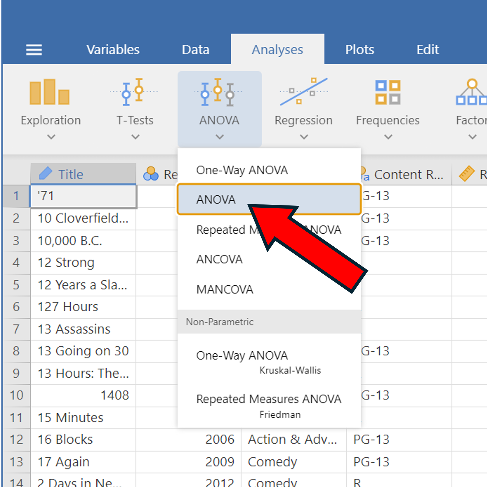
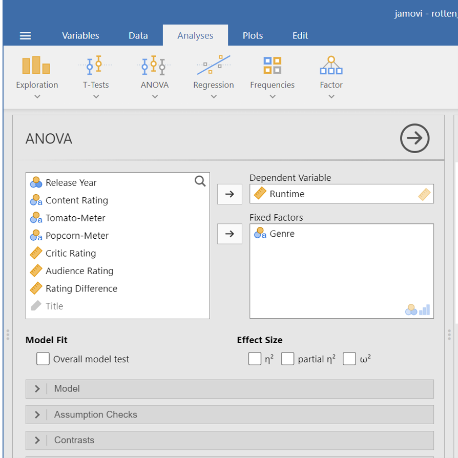
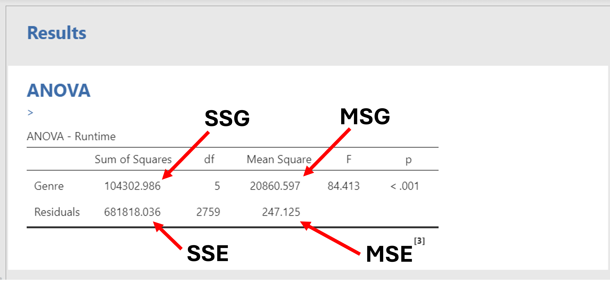
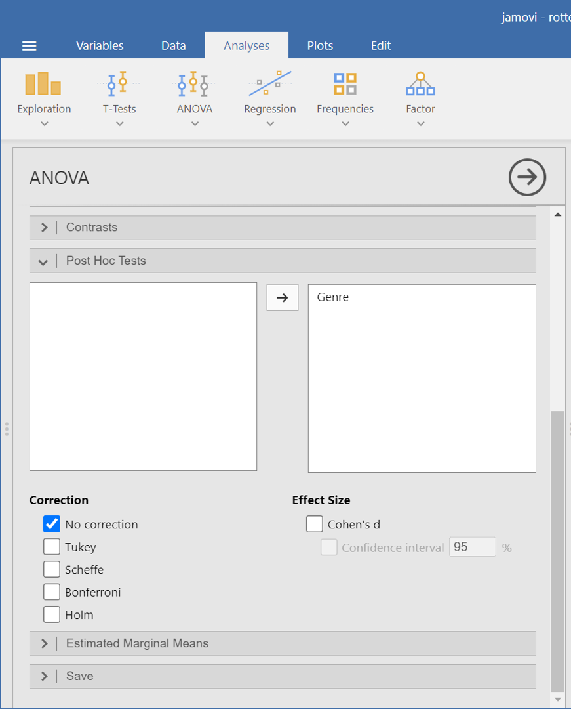
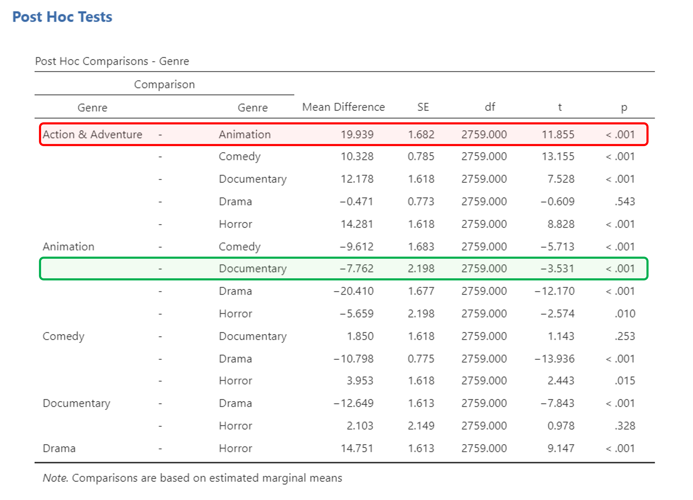

## ANOVA and Multiple Comparisons

In this section we'll go over how to do ANOVA in jamovi. We're going to use the **rotten_tomatoes.csv** dataset to see if there is a difference in average runtime between different genres of movies.

1. In the 'Analyses' tab, click on 'ANOVA' --> 'ANOVA' (Note: do NOT click on 'One-Way ANOVA'. It won't have all of the information we need)
2. Add the **Runtime** variable to the 'Dependent variable' window
3. Add the **Genre** variable to the 'Fixed Factors' window

::: {layout-ncol=2}

{.lightbox width=100%}

{.lightbox width=100%}

:::

Your window should look something like the following. We use different notation than jamovi, so the image is labeled using 'our' notation:

{width=70% fig-alt="alt text to be replaced"}

When you see the word 'Residual', you can think of it as being synonymous with 'Error'.

## Multiple Comparisons

After performing ANOVA and getting a p-value less than 0.05, we may want to then do multiple comparisons. To do this, stay on the ANOVA page from the previous section. Then:

1. Click on 'Post Hoc Tests' on the left side of the screen under the variable windows.
2. Place the **Genre** variable from the window on the left to the window on the right.
3. Under the **Correction** label, make sure the only box checked is 'No correction'.

{.lightbox width=50%}

After doing this, you should get the following table:

{#fig-multiple-comparisons .lightbox width=100%}

#### Interpreting the table

Focus on the 1st row of the table, highlighted in red in @fig-multiple-comparisons.

This says that Action & Adventure movies are estimated to be $19.939$ minutes longer than Animation movies, on average. The standard error for this estimate is $1.682$ minutes, the t-statistic for this estimate is $11.855$, and the p value is smaller than $0.001$.

Now focus on the 7th row of the table, highlighted in green in @fig-multiple-comparisons.

This says that Animation movies are estimated to be $7.762$ minutes *shorter* than Documentary movies, on average. The standard error for this estimate is $2.198$ minutes, the t-statistic for this estimate is $-3.531$, and the p value is smaller than $0.001$.
