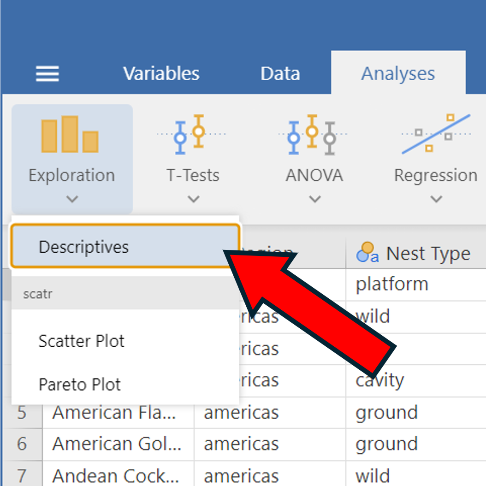
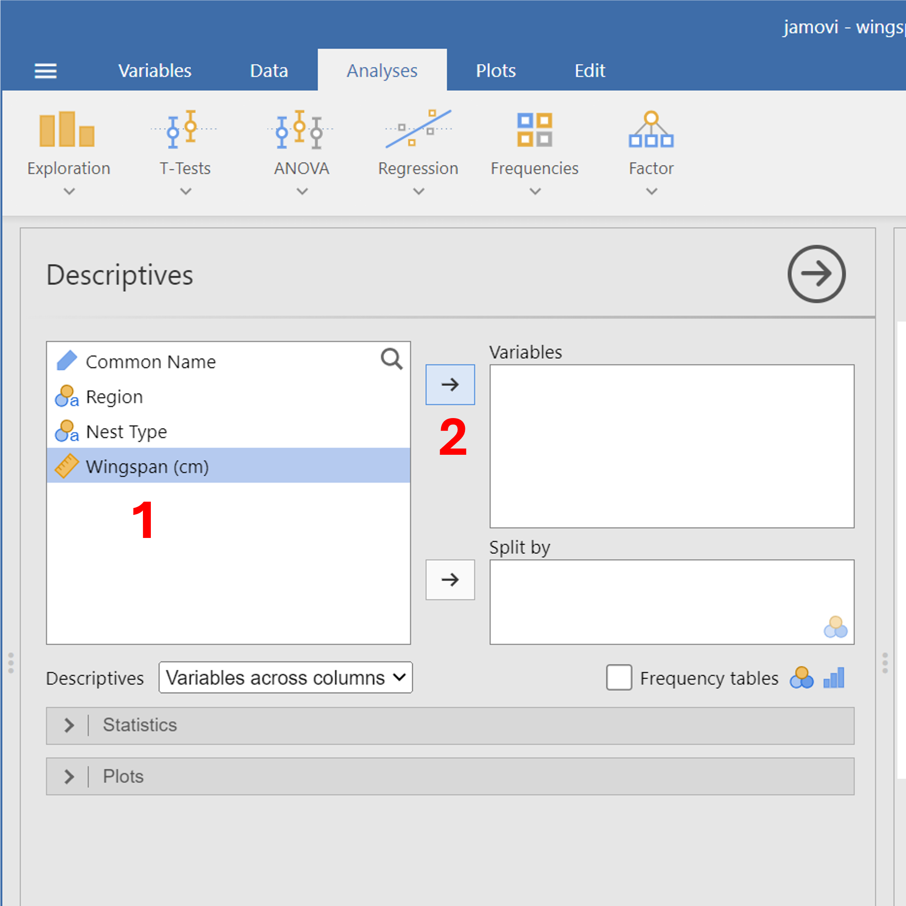
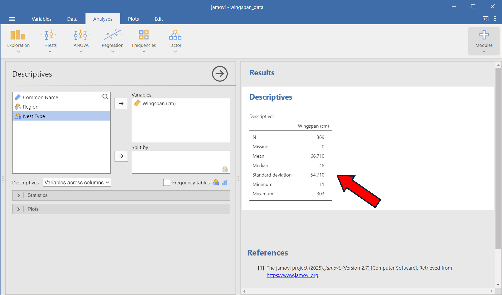
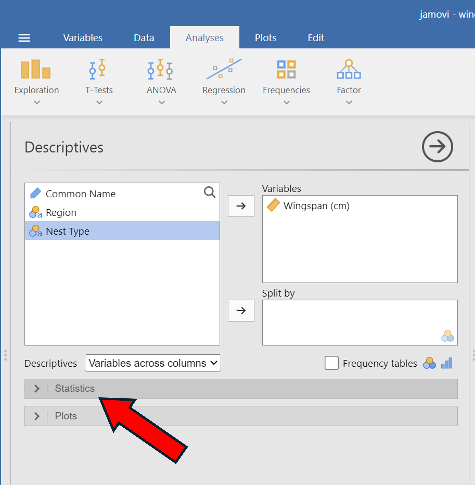
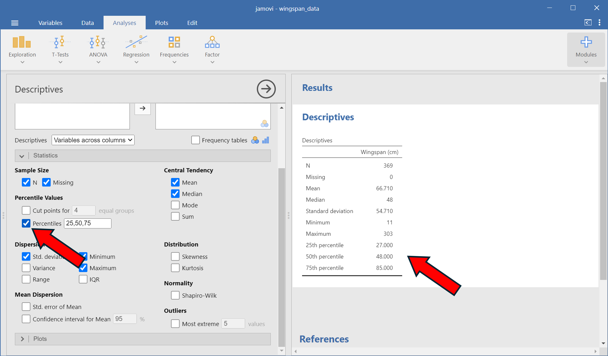
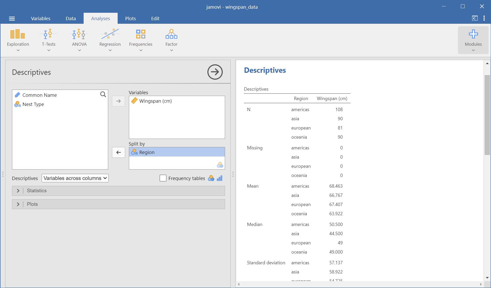
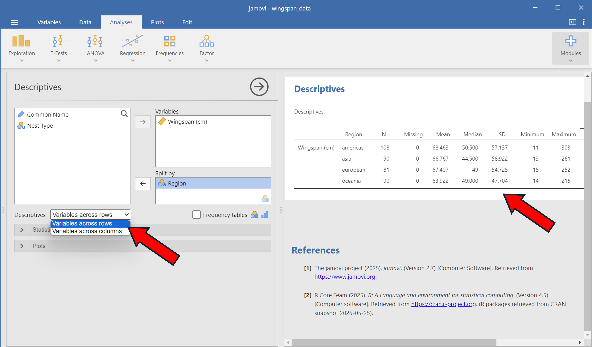

## Descriptive Statistics

In this section we'll go over how to calculate means, medians, quartiles, and other descriptive statistics for data. Begin by loading in the **wingspan_data.csv** dataset into jamovi.

## Default statistics

We'll begin by getting descriptive statistics for the wingspans of the birds.

1. Click on the 'Analyses' tab at the top of the window.
2. Click on 'Exploration' --> 'Descriptives'
3. To get statistics for the wingspans, click on the Wingspan variable on the left, then click on the arrow adding it to the 'Variables' window. You can also drag and drop variables into the window you want.

::: {layout-ncol=2}

{.lightbox width=100%}

{.lightbox width=100%}

:::

After following these steps, the window on the right half of the screen should show these descriptive statistics:

{width=100% fig-alt="alt text to be replaced"}

## Adding more statistics

By default, jamovi only shows the number of entries (N), the number of rows with missing values (Missing), the mean, median, standard deviation, minimum, and maximum. We can get other statistics by clicking on the 'Statistics' dropdown menu on the left half of the window:

{width=65% fig-alt="alt text to be replaced"}

We can see that we can add or remove a number of statistics from this menu. Most of them we can ignore, but let's add the quartiles to our summary. This can be done by going to the 'Percentile Values' term and checking the 'Percentiles' box. By default, the values for the 'Percentiles' box should be '25,50,75'; if they aren't set to this, change them and then check the box. You should now have the 1st, 2nd, and 3rd quartiles in your descriptive statistics table:

{width=100% fig-alt="alt text to be replaced"}

## Summary statistics split by group

Sometimes we want to look at summary statistics for particular groups. For example, we may want to compare the mean and median wingspan of birds from the European region to the mean and median wingspan of birds from Oceania region. To do this in jamovi, we can use the 'Split by' window. 

Just like how we added the **Wingspan** variable to the 'Variables' window, add the **Region** variable to the 'Split by' window: 

{width=100% fig-alt="alt text to be replaced"}

On the right half of jamovi, we can see now that each of our statistics is now split up by region. It's a little difficult to read though. Click on the 'Descriptives' drop down menu below the variable names and select 'Variables across rows' to group them horizontally instead of vertically.

{width=100% fig-alt="alt text to be replaced"}

In the next section, we'll show how to visualize distributions of data by creating tables and graphs.

