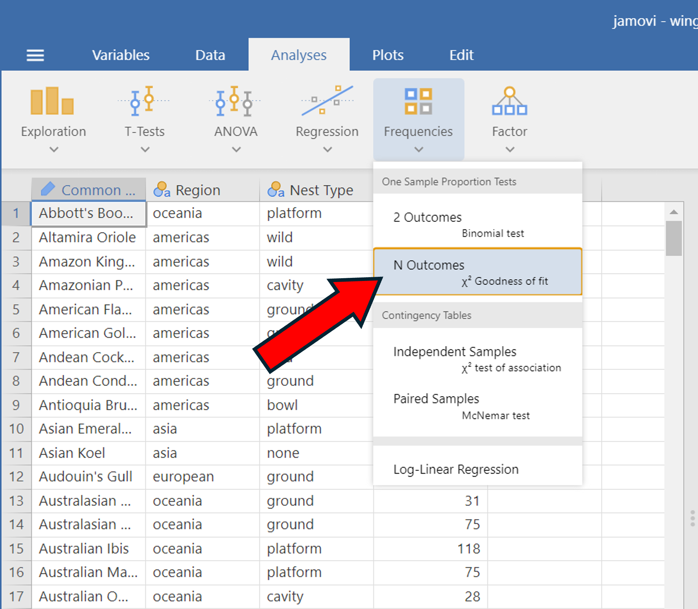
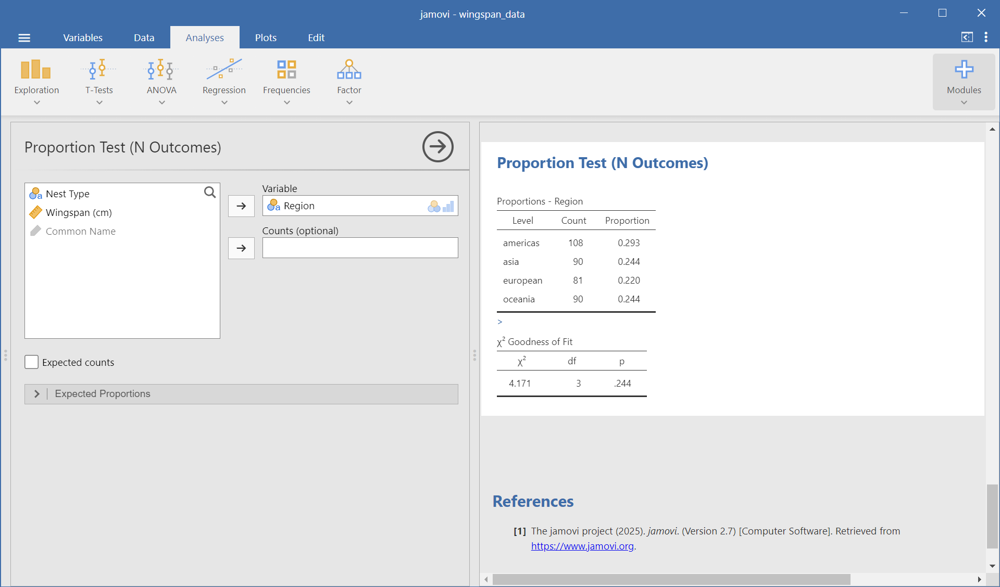
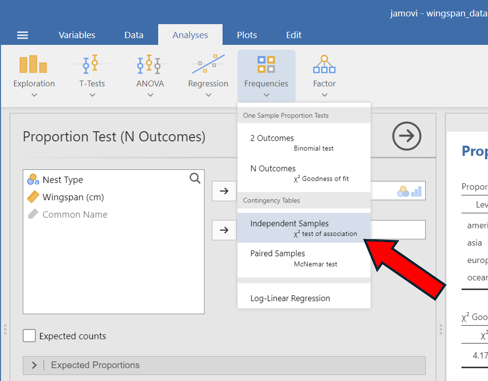
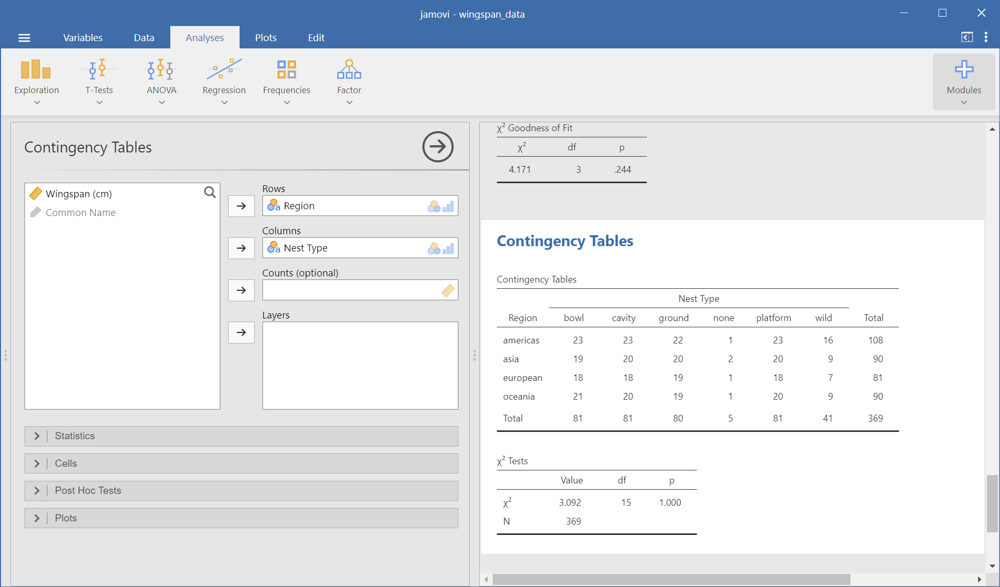
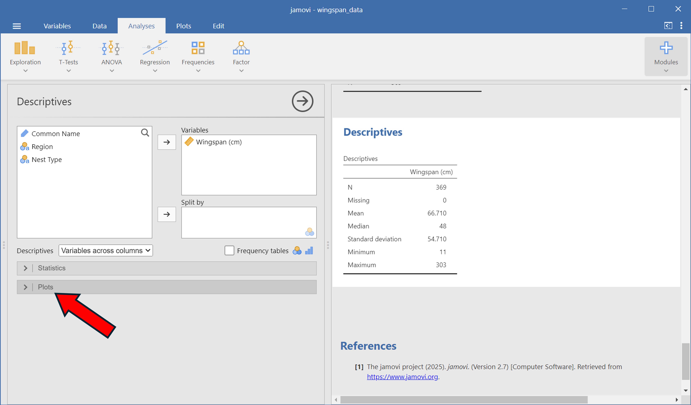
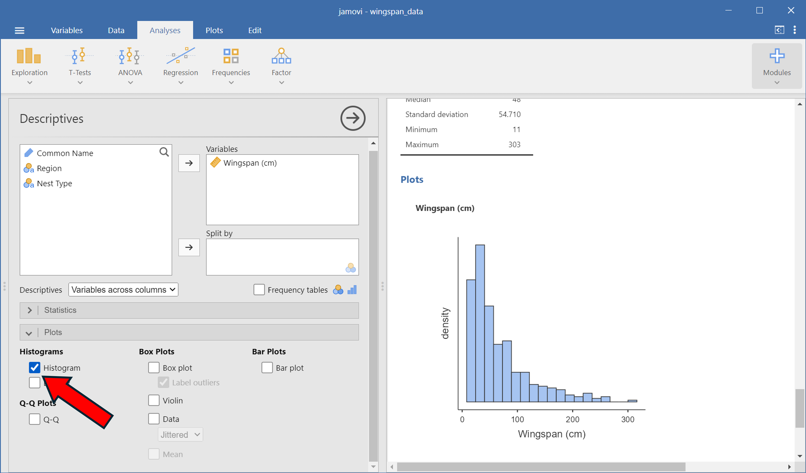
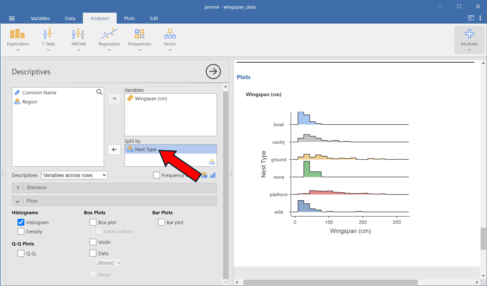
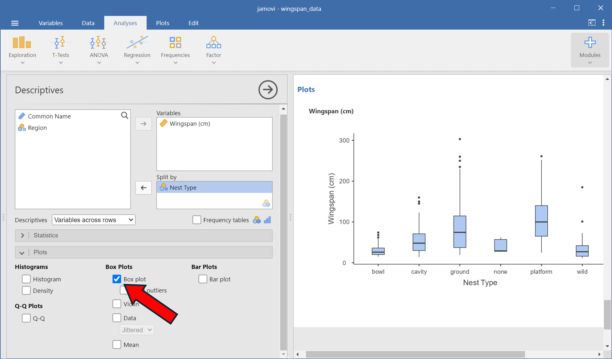

## Plots and Tables

In this section we'll go over how to generate 1-way and 2-way tables for categorical data, as well as how to generate histogram and boxplots for quantitative data.

## Tables

### One-Way Tables

First, we'll create a one-way table of regions. 

1. Under 'Analyses', click on 'Frequencies' --> 'N Outcomes'
2. Add the **Region** variable to the 'Variables' window

{.lightbox width=50%}

Your jamovi settings and output should look like the following:

{.lightbox width=100%}

### Two-Way Tables

Next, we'll create a two-way table (what jamovi calls a *contingency table*) of **Nest Type** vs **Region**.

1. Under 'Analyses', click on 'Frequencies' --> 'Independent Samples'
2. Add the **Region** variable to the 'Rows' window
3. Add **Nest Type** to the 'Columns' window

{.lightbox width=50%}

Your jamovi settings and output should look like the following:

{.lightbox width=100%}

## Plots

We're going to learn how to make histograms and boxplots of the **Wingspan** variable. To do so, we'll start with the following:

1. Under 'Analyses', click on 'Exploration' --> 'Descriptives'
2. Add the **Wingspan** variable to the 'Variables' window
3. Click on the 'Plots' dropdown menu below

{width=100% fig-alt="alt text to be replaced"}

### Histograms

Now click on the 'Histogram' check box to create a histogram of wingspans. 

{.lightbox width=100%}

It's also easy to split the histograms by another variable. We'll create a histogram of wingspans for each nest type by adding the **Nest Type** variable into the 'Split By' window:

{.lightbox width=100%}

### Boxplots

Similarly, we can create boxplots by selecting the 'Boxplot' checkbox as seen below:

{width=100% fig-alt="alt text to be replaced"}

