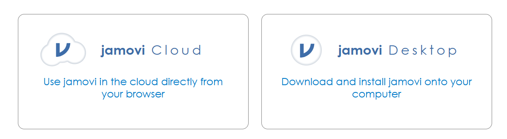
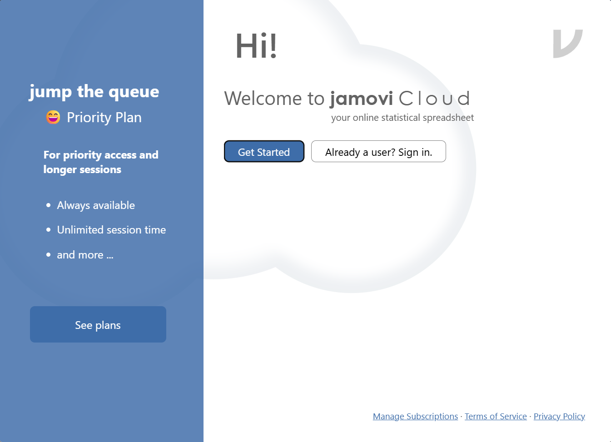
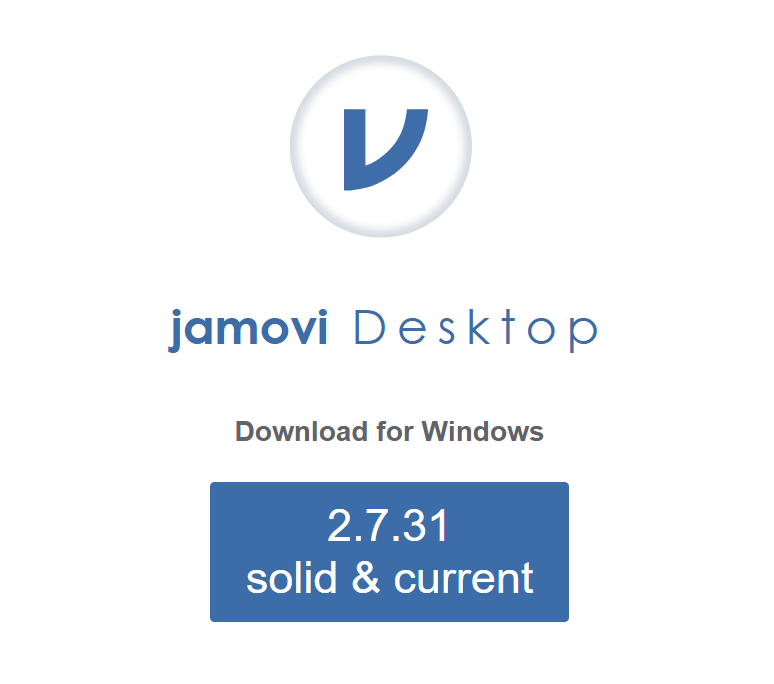
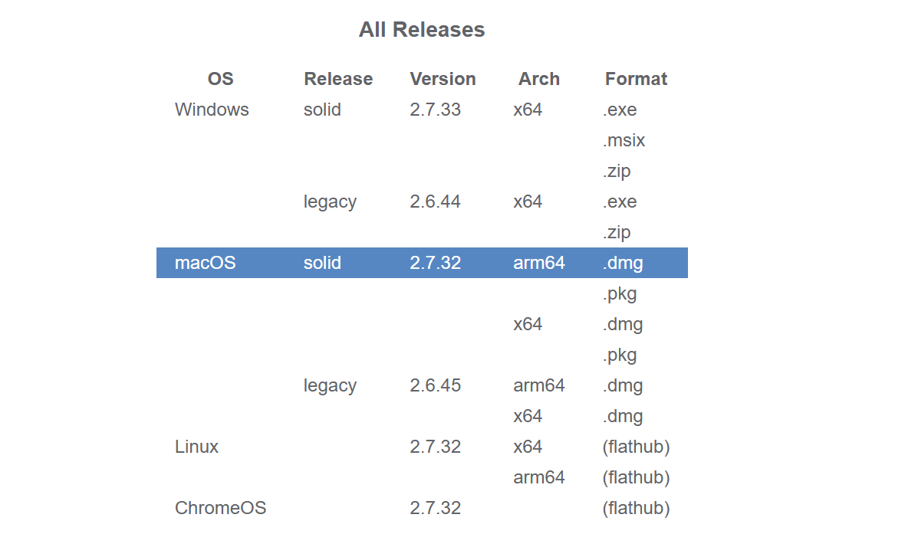

## Installing jamovi

## What is jamovi?

jamovi is a statistical software that we will use for homework assignments in this class. You can think of it like a fancy calculator that can read in data and quickly calculate statistics, summarize data, and create visualizations.

## Where do I get jamovi?

Start by going to [jamovi.org](jamovi.org). After scrolling down a bit, you should see something like the figure below:

{#fig-jamovi-option width=80%}

The option on the left is **jamovi Cloud**, which allows you to use jamovi in your browser without downloading or installing anything. The option on the right is **jamovi Desktop**, which downloads and installs jamovi onto your computer. 

## Should I use jamovi Cloud or jamovi Desktop? 

In this class, you can use either. The benefit of jamovi Cloud is that you don't need to download or install anything. The downsides are that you can only use jamovi Cloud when you have an internet connection, you have a limited number of minutes per session, and you'll need to sign up for an account. We would recommend jamovi Desktop, but feel free to use jamovi Cloud if you're having trouble with the download and installation steps.

## jamovi Cloud

If you opt to use jamovi Cloud, all you need to do is click on 'jamovi Cloud', then click on 'Start', which should open up a screen like this:

You'll need to start by creating an account.

Click on 'Get Started' --> 'Sign in as Guest' --> 'Sign in with email'. Enter your CSU email, click on 'Next', and then set your password. Then click on 'Send verification' and click the link that is emailed to you to verify your account. It may take a few minutes for it to show up in your inbox. 

::: {.callout-warning}
## Check your spam folder! 

Sometimes the verification emails can get filtered; make sure to check your spam/junk folder for the verification email.
:::

## Downloading and Installing jamovi Desktop 

#### Download for Windows

After clicking on jamovi Desktop from the page seen in @fig-jamovi-option, you should see the following screen, or something similar:

{#fig-jamovi-desktop-download width=50%}

Click on whatever the "solid & current" version is (the number may be different than what you see in @fig-jamovi-desktop-download) to download jamovi.

#### Download for Mac

After clicking on jamovi Desktop from the page seen in @fig-jamovi-option, scroll down until you see something like this:

{#fig-jamovi-mac-download width=50%}

Click on whatever the stable version for Mac is to download it.

---

Regardless of whether you have a Mac or Windows computer, double click on the file after it finishes downloading to open the installation wizard and follow the default steps to install jamovi. After it finishes installing, locate the app and start it.