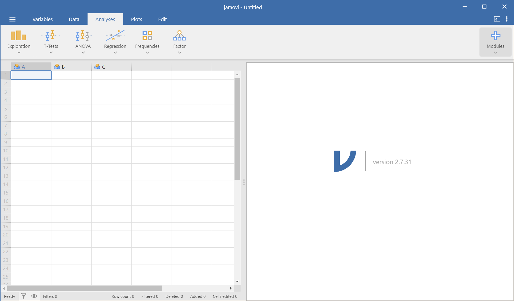
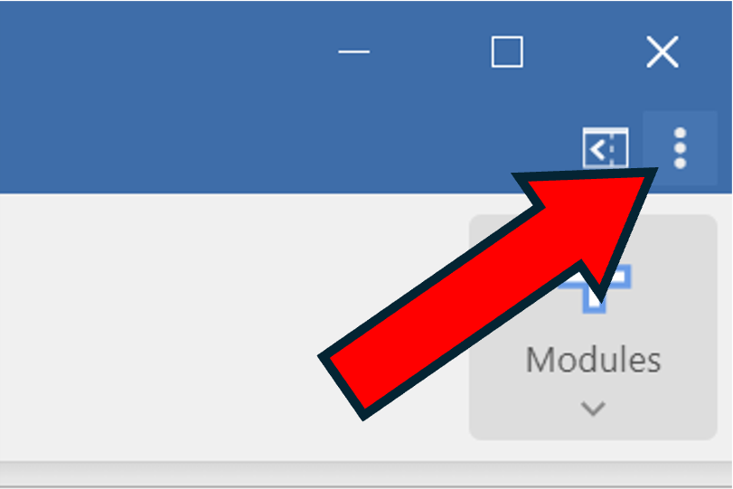
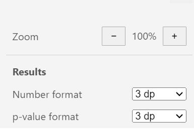
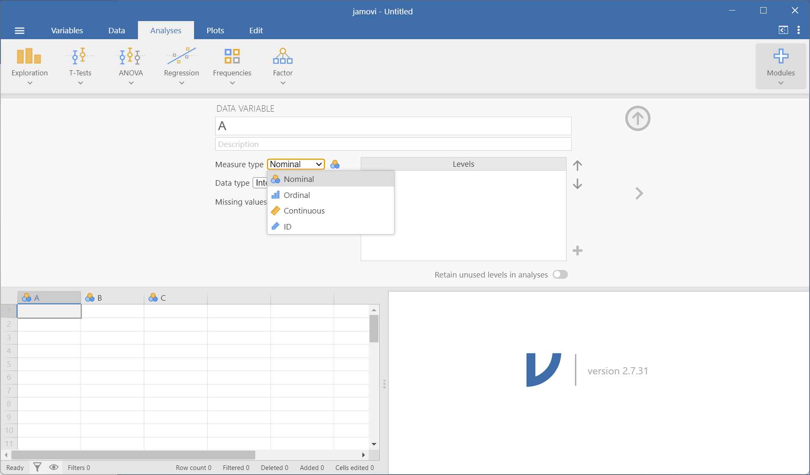
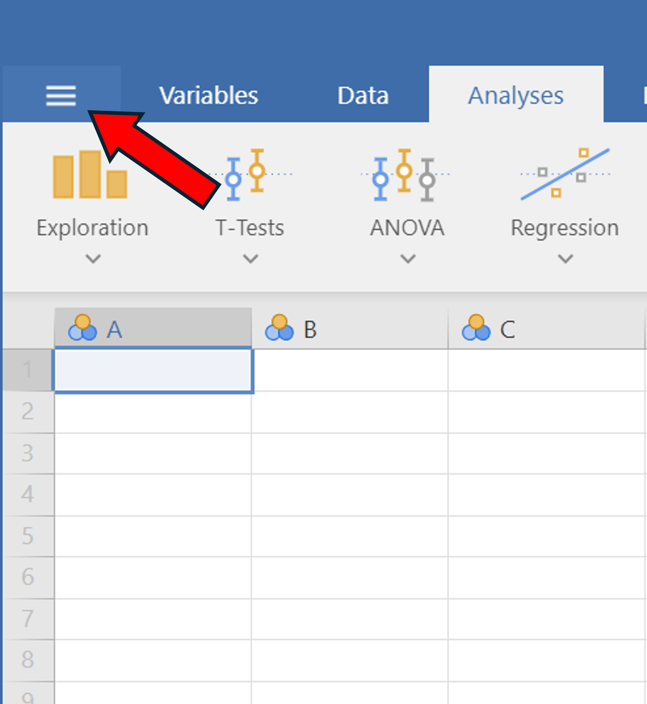
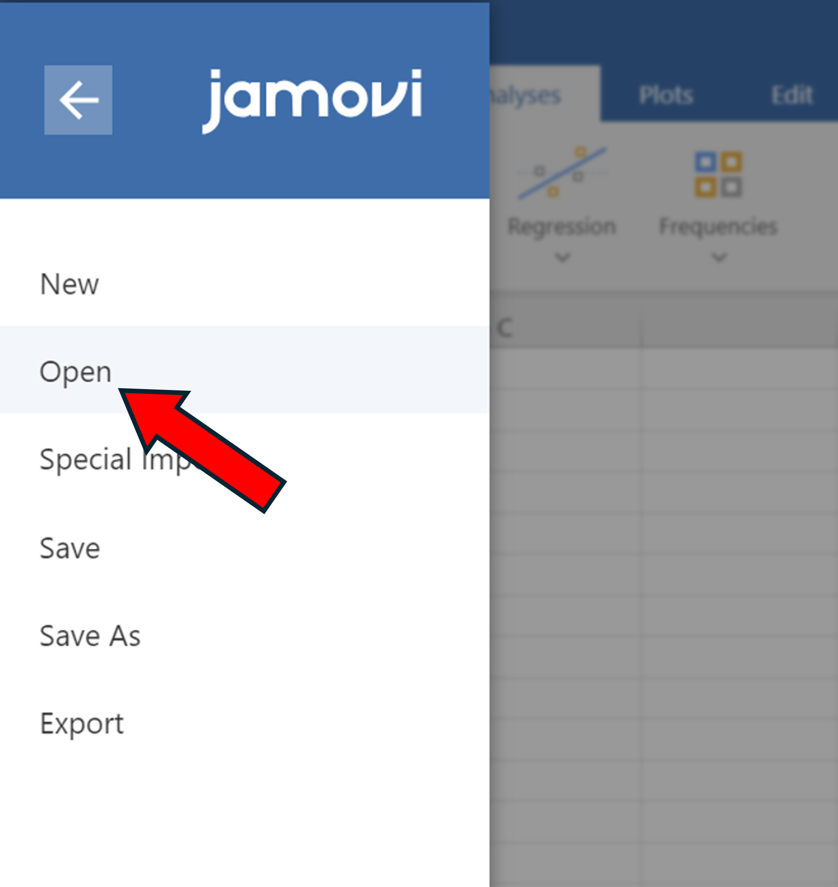
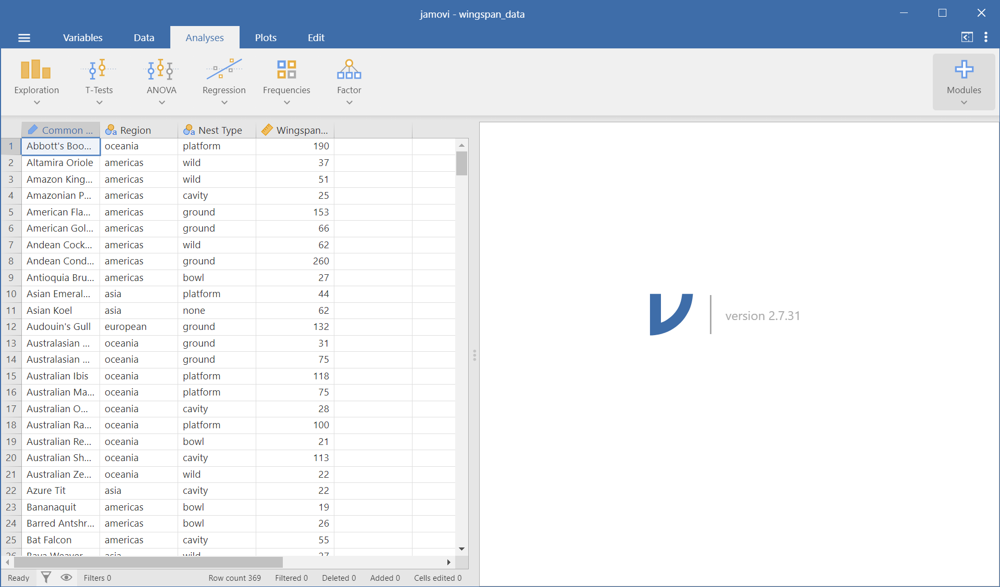

## Setting up jamovi and Reading Data

After installing jamovi and opening it up, you should see a screen without any data in it, like the image below:

The **VERY FIRST** thing we need to do is to change the number formatting:

1. Click on the three vertical dots in the very top right corner of the screen
2. Click on the dropdown menus for 'Number format' and 'p-value format', and set them *both* to **3 dp**. Make sure they are *not* set to **3 sf** or anything else.

::: {layout-ncol=2}

{.lightbox width=100%}

{.lightbox width=100%}

:::

To do analysis in jamovi, we'll first need data! We can either read data in via a file, or we can enter it in manually.

## Entering Data Manually

To enter in data manually, you can directly type in numbers or text into each cell like in an Excel sheet. To change the name of the variable and the data type, double click the top of the column (where it has the label 'A'). It should bring up the following menu:

{width=100% fig-alt="alt text to be replaced"}

At the top, you can change the name of the variable to something other than 'A', and add an optional description. You can also change the variable type; here 'Nominal' is equivalent to what we refer to as **Categorical**, and 'Continuous' is equivalent to what we call **Quantitative**. They have a third option called 'Ordinal', which we don't have to worry about, and a fourth option called 'ID', which is typically for unique identifiers like names or ID numbers.

## Reading in Data

In this course, data is typically in a "Comma-Separated Values" file or **CSV** file for short, which stores data in a table format. Basically all of the data we work with in this course will be stored in CSV files. 

Start by downloading the **wingspan_data.csv** file from Canvas. Then in jamovi:

1. Click on the three horizontal lines in the top left corner.
2. Click 'Open'
	a. (If you're using jamovi Desktop) Click 'Browse'
	b. (If you're using jamovi Cloud) Click 'This Device'
3. This will bring up a file explorer window. Locate the **wingspan_data.csv** file you just downloaded and click 'Open'.

::: {layout-ncol=2}

{.lightbox width=100%}

{.lightbox width=100%}

:::

Your jamovi should then look like the following:

{width=100% fig-alt="alt text to be replaced"}

Great! Now we have data that we will do analysis on in the next chapter.

