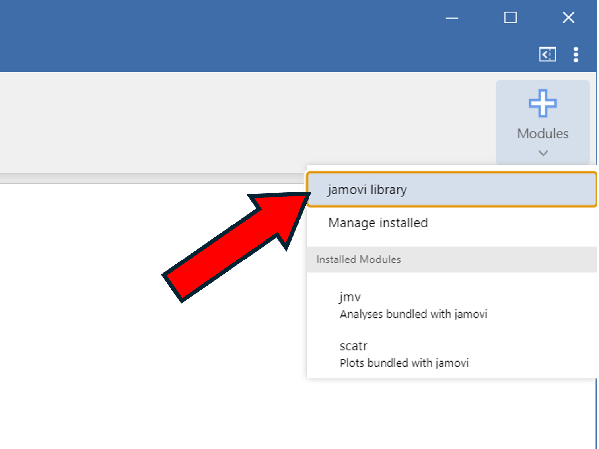
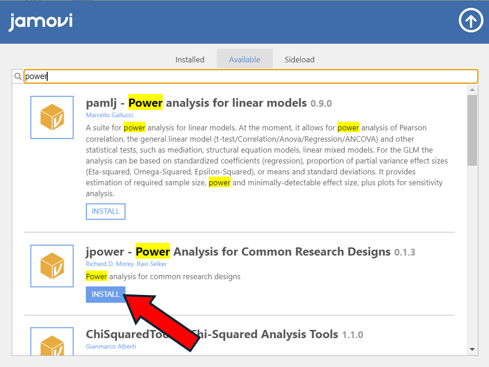
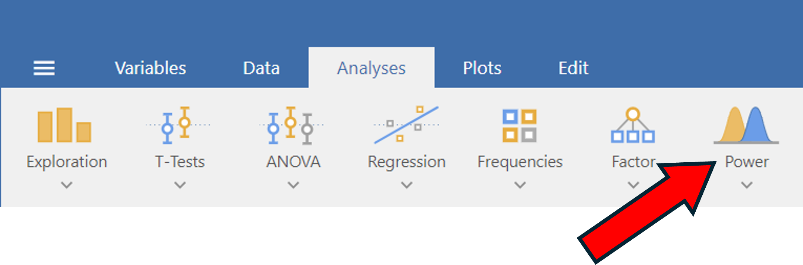
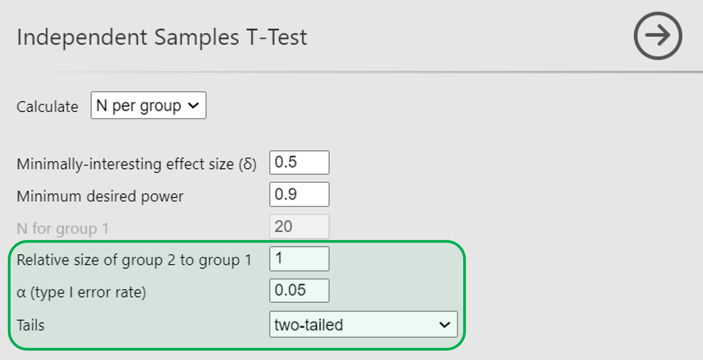
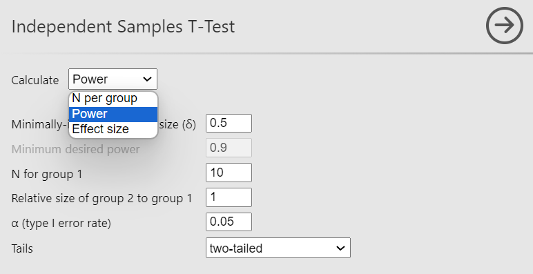
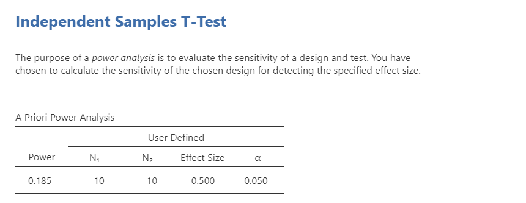
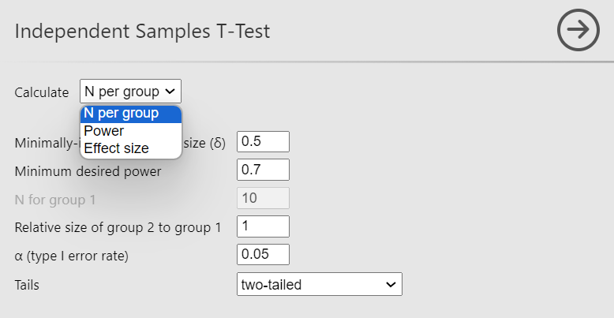
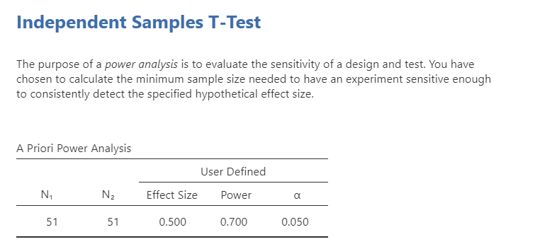
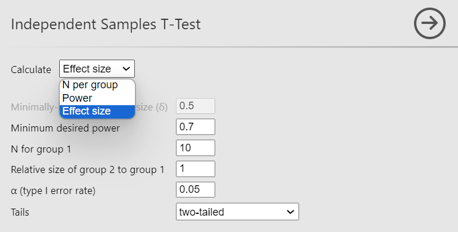
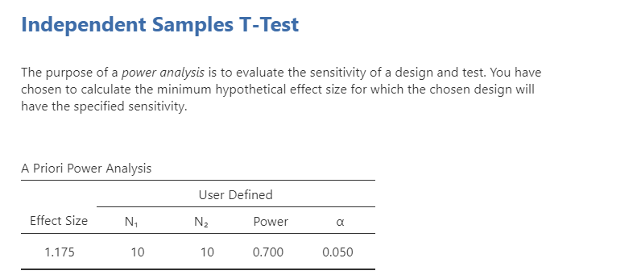

## Power Analysis

In this section we'll go over how to do power analysis in jamovi. There are two things to note in this section that differ from others we've done!

1. Power analysis isn't included in jamovi be default, so we'll need to download an additional **module**.
2. We don't need any data for this section!

### Downloading the Power Module

1. Click on the 'Modules' --> 'jamovi library'.
2. Under the 'Available' tab, use the search bar and type in 'power'
3. Scroll until you see a module called 'jpower'.
4. Click the 'install' button.

::: {layout-ncol=2}

{.lightbox width=100%}

{.lightbox width=100%}

:::

If done correctly, you should now have a 'Power' section at the top of the screen in the 'Analyses' tab.

{.lightbox width=100%}

### Power Module settings.

Under the 'Analyses' tab, click on 'Power' --> 'Independent Samples T-test'. Make sure you have the following settings:

1. '$\alpha$ (type I error rate)' $= 0.05$
2. 'Relative size of group 2 to group 1' $= 1$
3. Tails = 'two-tailed'

{.lightbox width=75%}

Power analysis problems can come in three different varieties:

1. Given a sample size and effect size, calculate power.
2. Given power and an effect size, calculate the sample size.
3. Given power and a sample size, calculate the effect size.

### Computing Power

For this problem, let's assume we have a sample size of $20$ and an effect size of $0.5$. To calculate power:

1. Click the dropdown menu next to 'Calculate' and select 'Power'
2. Set 'Minimally-interesting effect size ($\delta$)' $= 0.5$
3. Set 'N for group 1' $= 10$

{.lightbox width=50%}

Your output should look like the following:

{.lightbox width=75%}

The power given in the table is $0.185$. That means that for a sample size of $20$ and an effect size of $0.5$, the probability of correctly rejecting a t-test is $0.185$.  

::: {.callout-warning}
## Note the sample size!

If we want a total sample size of $20$, we want $10$ observations in each group. That's why we set $N = 10$ even though we stated at the beginning that the sample size of interest is $20$.
:::

### Computing Sample Size

For this problem, we'll set our effect size to $\delta = 0.5$ and the power to $0.7$, and we'll calculate the minimum sample size required.

1. Click the dropdown menu next to 'Calculate' and select 'N per group'
2. Set 'Minimally-interesting effect size ($\delta$)' $= 0.5$
3. Set 'Minimum desired power' $= 0.7$

{.lightbox width=50%}

Your output should look like the following:

{.lightbox width=75%}

The sample size required *for each group* is 51, so the *total* sample size required is $51 + 51 = 102$. 

### Computing Effect Size

Finally, we'll calculate effect size given sample size and desired power. We'll use a sample size of $20$ and a power of $0.7$

1. Click the dropdown menu next to 'Calculate' and select 'Effect size'
2. Set 'Minimum desired power' $= 0.7$
3. Set 'N for group 1' $= 10$

{.lightbox width=50%}

Your output should look like the following:

{.lightbox width=75%}
