## Linear Regression

In this section we'll go over how to compute correlations and do simple and multiple linear regression in jamovi. We're going to predict the height of a tree using its diameter and species. Begin by loading in the **tree_data.csv** dataset from Canvas.

### Correlation

Let's start by computing the correlation between the height and diameter of the trees.

1. Under 'Analyses' click on 'Regression' --> 'Correlation Matrix'
2. Add the **Diameter** and **Height** variables to the variables window.

::: {layout-ncol=2}

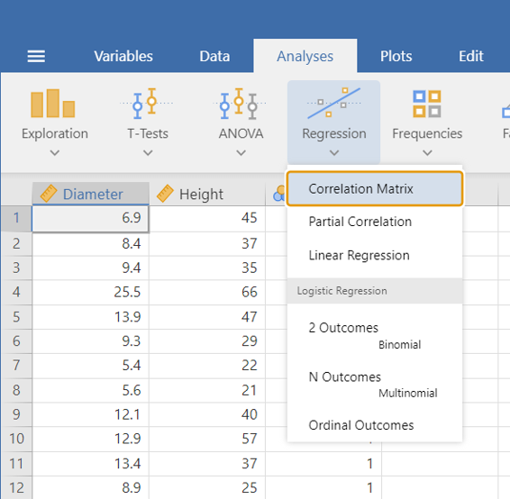{.lightbox width=100%}

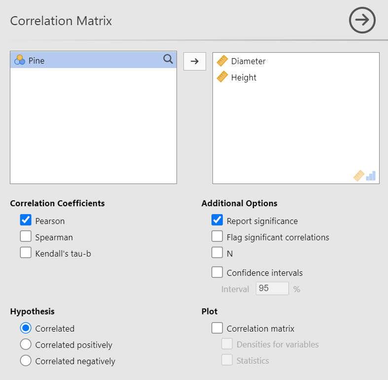{.lightbox width=100%}

:::

You should get the following output:

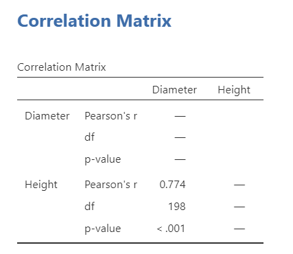{.lightbox width=50%}

### Simple Linear Regression

1. In the Analysis tab, click on 'Regression' --> 'Linear Regression'.
2. Add the **Height** variable to the 'Dependent Variable' window.
3. Add the **Diameter** variable to the 'Covariates' window.

::: {layout-ncol=2}

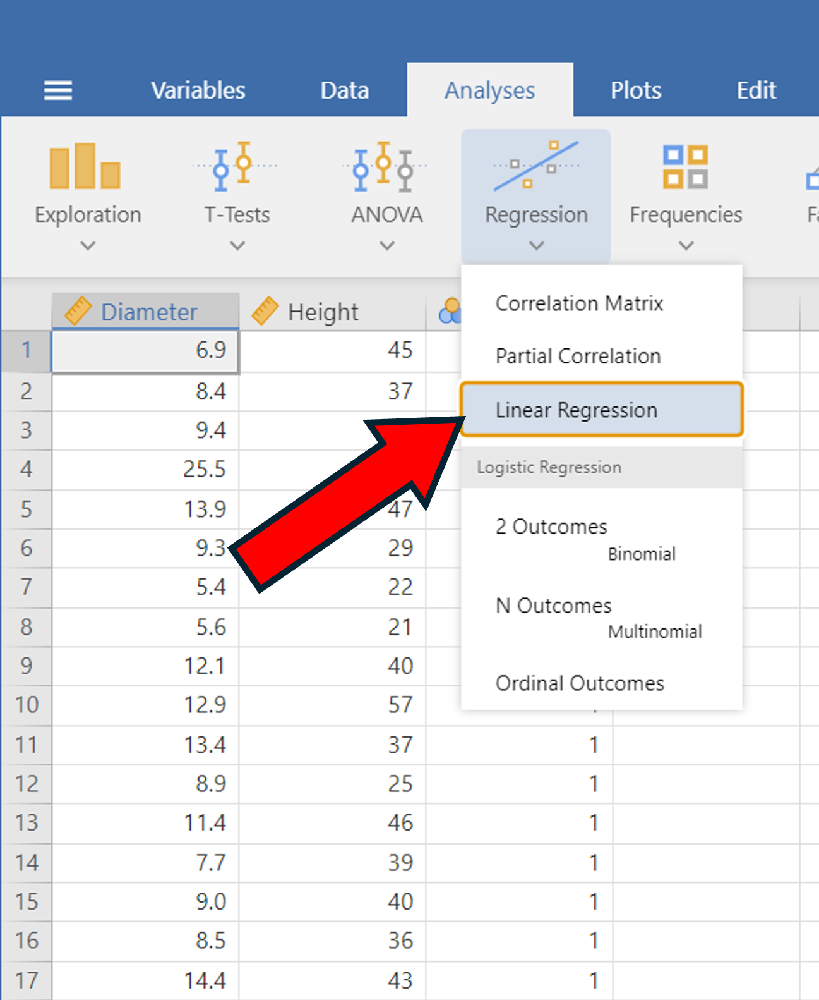{.lightbox width=100%}

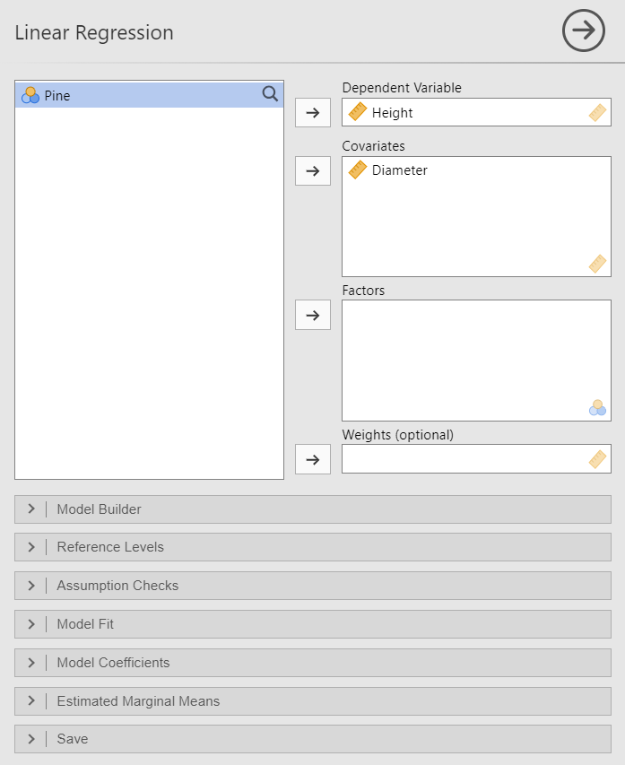{.lightbox width=100%}

:::

That's it! Your output should match the image below:

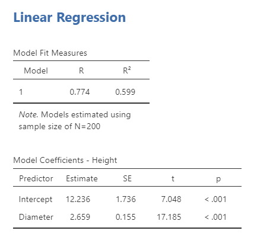{.lightbox width=50%}

### Multiple Linear Regression

#### Adding a Binary Variable

Now we're going to add the binary variable **Pine** which tells us if the observation is a Pine tree ($1$) or a Fir tree ($0$). Add the **Pine** variable to the 'Factors' window to get the following output:

::: {layout-ncol=2}

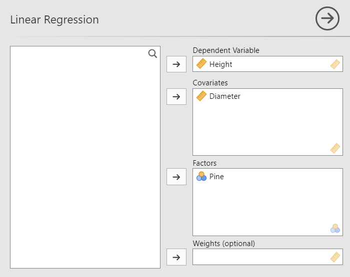{.lightbox width=100%}

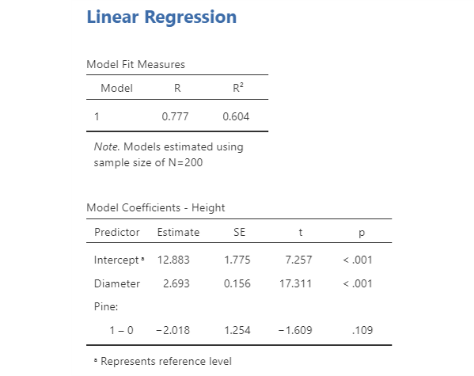{.lightbox width=100%}

:::

#### Adding an Interaction Variable

Our **Pine** variable improved the fit, but was not statistically significant. It may be the case that Pine trees' diameters grow at a different rate relative to their height than Fir trees do. To test this, we're going to add an interaction between the **Diameter** variable and the **Pine** variable.

To do this, we need to create an interaction variable. Go back to the data and:

1. Double click on an empty data column to bring up a 'new variable' window
2. Click on 'New Computed Variable'
3. Name the variable 'Interaction' and in the window that has $f_x$ next to it, type in 'Pine * Diameter'
4. Hit enter

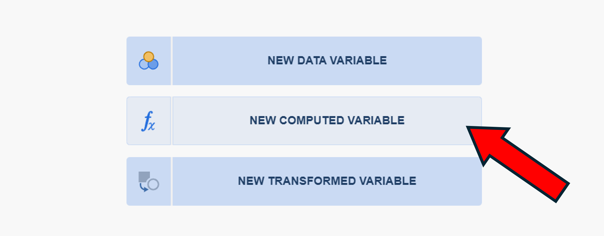{.lightbox width=80%}

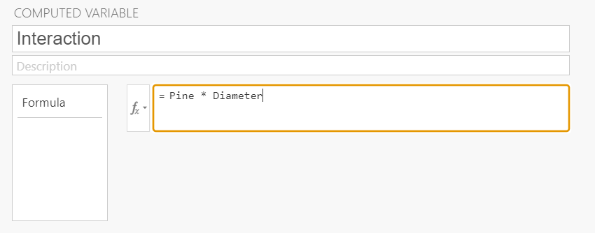{.lightbox width=80%}

You should have a new column called **Interaction**. Now go back to the linear regression page and add the **Interaction** variable to the 'Covariates' window.

::: {layout-ncol=2}

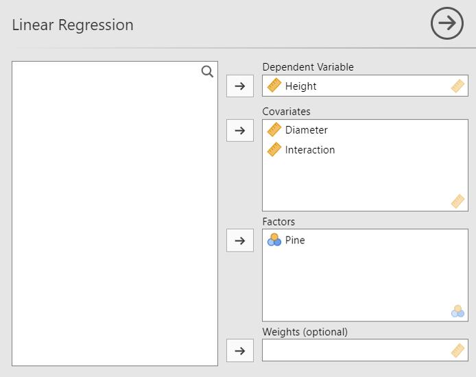{.lightbox width=100%}

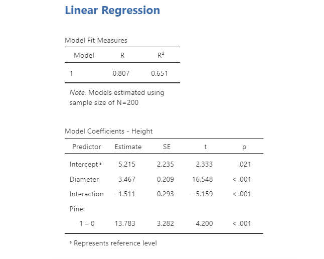{.lightbox width=100%}

:::