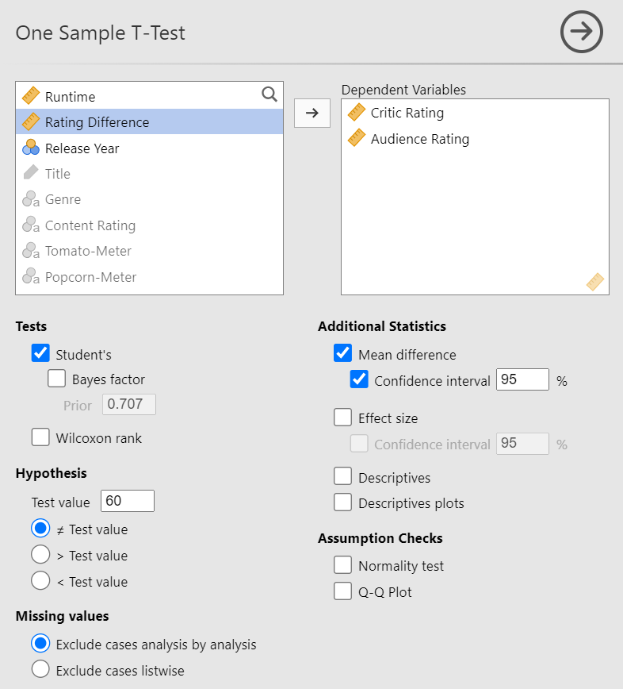
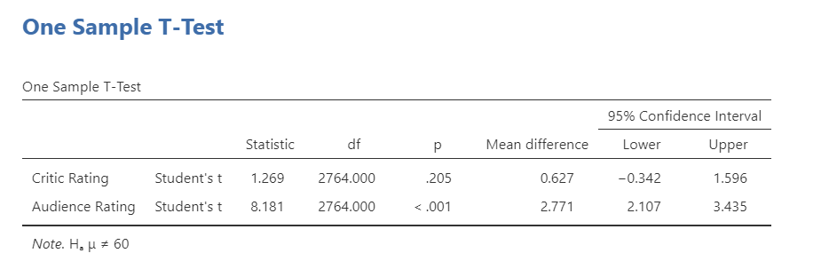
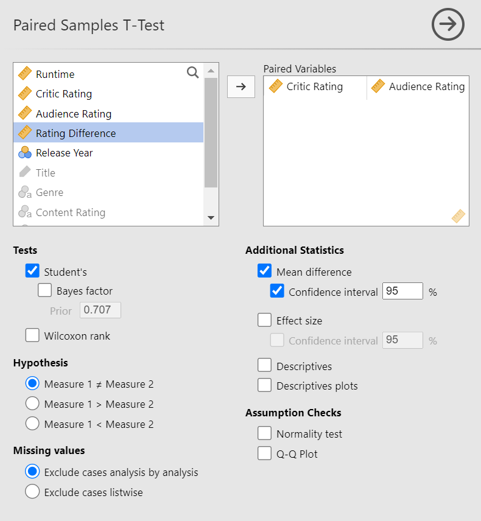
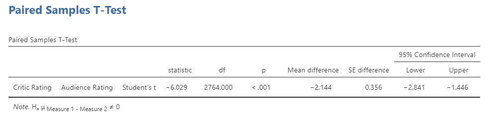
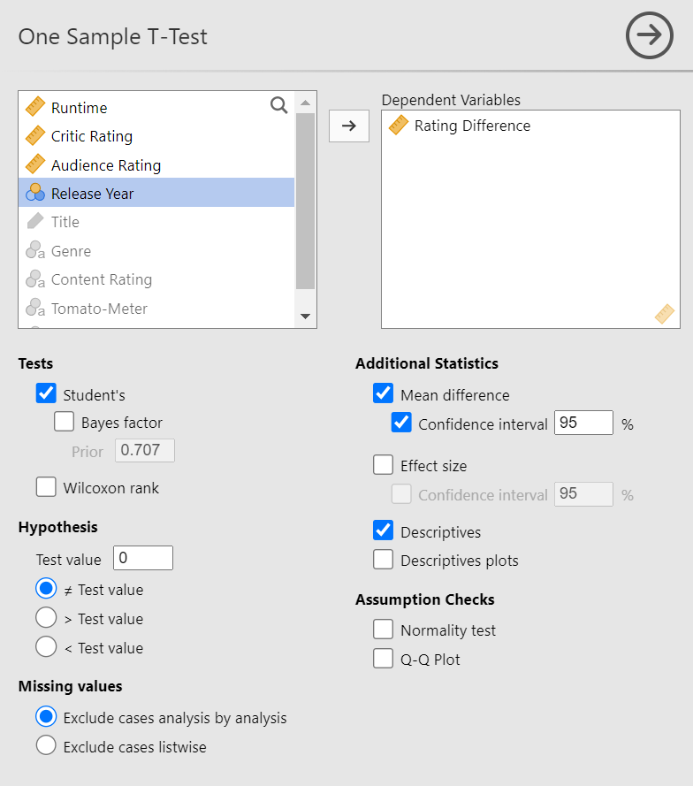
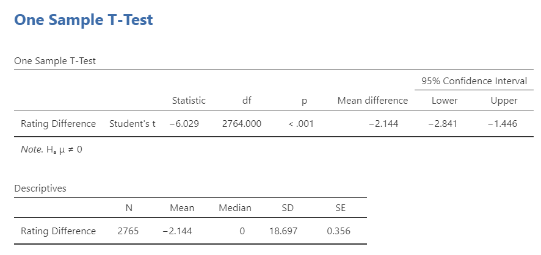

## T-Tests for One Population

In this section we'll learn how to compute t-statistics and confidence intervals for means in jamovi, including for paired differences. We'll use the **rotten_tomatoes.csv** dataset for this example, which has data on movies taken from RottenTomatoes.com. First, we'll calculate t-statistics and confidence intervals for **Critics Ratings** and **Audience Ratings** individually. Then, we'll do a paired test on their difference.

**Concept Check:** Why would the difference between the Critics and Audience ratings be *paired*?

::: {.callout-tip collapse="true"}
## Solution

This is paired because each observation (each movie) is 'measured' *twice*: once by critics and once by the audience. We should expect to see a relationship between these two measurements. Note that this is a little trickier than our typical notion of a paired study, which usually involves a *before* and *after* measurement.

:::

## T-Tests for Movie Ratings

We're going to test the hypothesis that $H_0:\mu = 60$ for both the **Critic Rating** and **Audience Rating** variables.

Start by loading in the **rotten_tomatoes.csv** dataset if you haven't already. Then:

1. Under Analyses, click 'T-Tests' --> 'One Sample T-Tests'
2. Add the **Critic Rating** and **Audience Rating** variables to the 'Dependent Variables' window.
3. Under **Tests**, ensure that 'Student's' is the only box checked (leave 'Bayes factor' unchecked)
4. Under **Hypothesis**, set 'Test value' to $60$ and click '$\ne$ Test value'
5. Under **Additional Statistics**, check 'Mean difference' and 'Confidence interval' are checked, and set the confidence interval to 95%

{.lightbox width=50%}

You should get the following output:

{.lightbox width=75%}

## Paired T-Test for Ratings Difference

### Method 1 (No **Ratings Differences** column)

Paired t-tests look at the mean and standard error of the *differences* column. If we have the two columns but we do *not* have the differences column, we can use the following procedure:

1. Under 'Analyses', click on 'T-Tests' --> 'Paired Samples T-Test'
2. Add the **Critics Rating** variable and the **Audience Rating** variable to the 'Paired Variables' window. Note that the order will determine the sign of the statistic
3. Under **Tests**, ensure that 'Student's' is the only box checked (leave 'Bayes factor' unchecked)
4. Under **Hypothesis**, click 'Measure 1 $\ne$ Measure 2'
5. Under **Additional Statistics**, check 'Mean difference' and 'Confidence interval' are checked, and set the confidence interval to 95%

The final settings should look like so:

{.lightbox width=75%}

And you should get the following table:

{.lightbox width=75%}

### Method 2 (Differences column)

If a column is present that already has the differences between our two variables of interest, then we can just perform a one-sample t-test the same way we did in the previous section:

1. Under 'Analyses', click on 'T-Tests' --> 'One Sample T-Test'
2. Add the **Rating Difference** variable to the 'Dependent Variables' window
3. Under **Tests**, ensure that 'Student's' is the only box checked (leave 'Bayes factor' unchecked)
4. Under **Hypothesis**, set 'Test value' to 0 and click '$\ne$ Test value'
5. Under **Additional Statistics**, check 'Mean difference' and 'Confidence interval' are checked, and set the confidence interval to 95%
6. Also under **Additional Statistics**, we need to check the 'Descriptives' box to get the standard error.

The final settings should look like so:

{.lightbox width=75%}

And you should get the following table:

{.lightbox width=75%}
