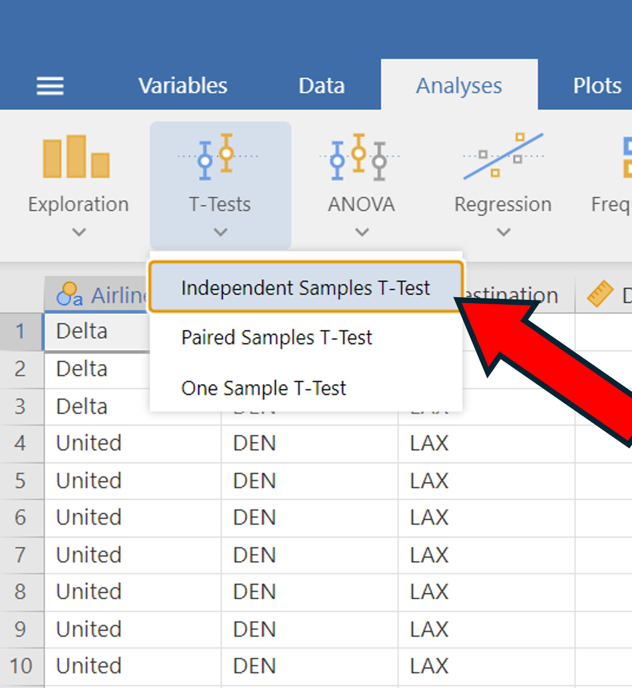
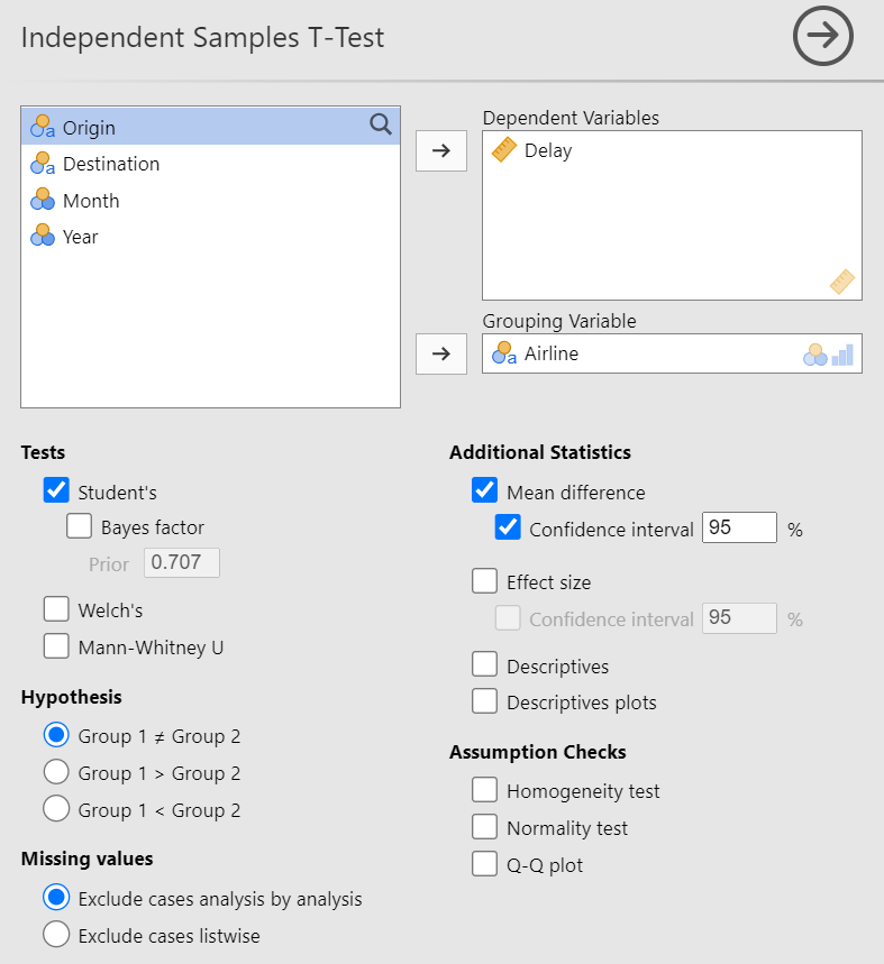
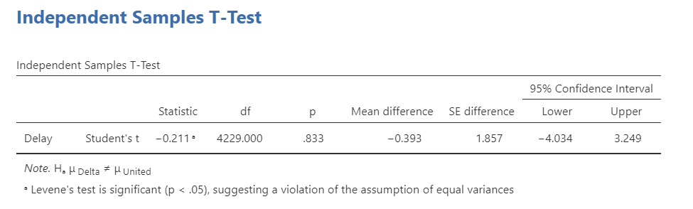

## T-Tests for Two Populations (Unpaired)

In this section we'll go over how to calculate t-statistics, standard errors, and confidence intervals for a difference of means problem with unpaired data. We're going to estimate the difference in mean arrival delay times between Delta flights and United flights from Denver to LA in 2024 using the **flight_data.csv** dataset. 

In other words, we are going to test the hypothesis  $H_0: \mu_{Delta} = \mu_{United}$, where $\mu$ represents the population average arrival delay time from Denver to LA.

Start by loading in that data set. Then:

1. Go to the Analyses tab and click on 'T-Tests' --> 'Independent-Samples T-Test'
2. Add the **Delay** variable into the 'Dependent Variables' window
3. Add the **Airline** variable into the 'Grouping Variable' window
4. Ensure that the following boxes are checked:
	a. 'Student's'
	b. 'Mean Difference'
	c. 'Confidence Interval (95%)'
	d. 'Group 1 $\ne$ Group 2'

::: {layout-ncol=2}

{.lightbox width=100%}

{.lightbox width=100%}

:::

Your output should look like this:

{.lightbox width=100%}

